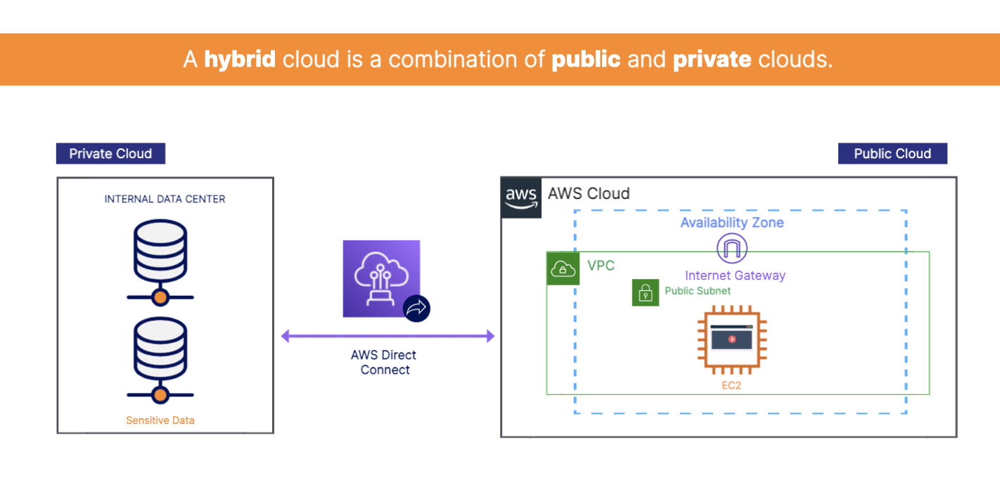
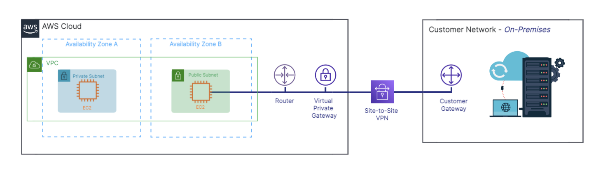
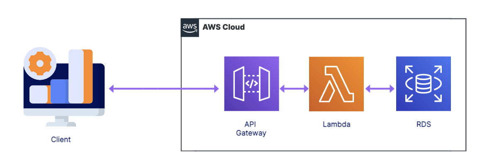

# Content Delivery Services 

A CDN is a mechanism to deliver content quickly and efficiently based on geographic location.

## Amazon CloudFront
- CloudFront is a CDN that delivers data and applications globally with low latency.
    - Makes content available globally or restricts it based on location
    - Speeds up delivery of  static and dynamic web content 
    - Uses edge locations to cache content
- Use Cases: 
    - S3 Static website: CloudFront is often used with S3 to deploy content globally.
    - Prevent attacks: CloudFront can stop certain web attacks, like DDoS. We'll talk more about DDoS in the security lesson.
    - IP Adressing Blocking: Geo-restriction prevents users in certain countries from accessing content.

## Amazon Global Accelerator 
- Global Accelerator sends your users through the AWS global network when accessing your content, speeding up delivery.
    - Improves latency and availability of single-Region applications
    - Sends traffic through the AWS global network infrastructure
    - 60% performance boost
    - Automatically re-routes traffic to healthy available regional endpoints

## Amazon S3 Transfer Acceleration 
- S3 Transfer Acceleration improves content uploads and downloads to and from S3 buckets.
    - Fast transfer of files over long distances
    - Uses CloudFront’s globally distributed edge locations
    - Customers around the world can upload to a central bucket

## Amazon Additional Networking Services
- DNS(Domain Name System): DNS stands for Domain Name System and directs internet traffic by connecting domain names with web servers.

- Amazon Route 53 
    - Route 53 is a DNS service that routes users to applications.
    - highly available and scalable  
    - Domain name registration, Performs health checks on AWS resources, and Supports hybrid cloud architectures
- Amazon Direct Connect 
    - Direct Connect is a dedicated physical network connection from your on-premises data center to AWS. (That means it's super fast.)
    - Connects your on-premises data center to AWS, Data travels over a private network, and support a hybird environment.
    
    - Use Cases: large datasets: Transfer large datasets to AWS; business-critical data:Transfer internal data directly to AWS, bypassing your internet service provider; hybird model: Build hybrid environments 
- Amazon VPN (Slightly cheaper than Direct Connect)
    - Site-to-Site VPN creates a secure connection between your internal networks and your AWS VPCs. 
    - Similar to Direct Connect, but data travels over the public internet
    - Data is automatically encrypted, Connects your on-premises data center to AWS, and support a hybird environment
    - Use case: A Site-to-Site VPN makes moving applications to the cloud easier.
    - VPN Tunnel(where the Virtual Private Gateway is the VPN connector on the AWS side and the Customer Gateway is the VPN connector on the customer side.)
     

- Amazon API Gateway
    - API Gateway allows you to build and manage APIs. 
    - Share data between Services, and Integrate with services like Lambda
    - Use case example: 
    