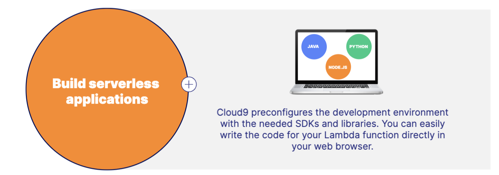
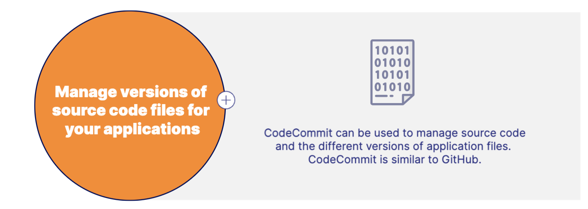
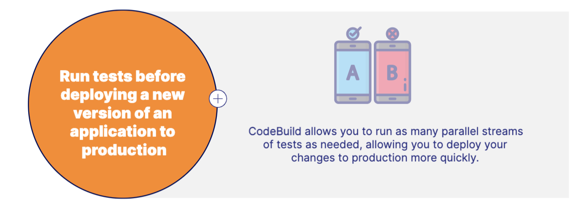
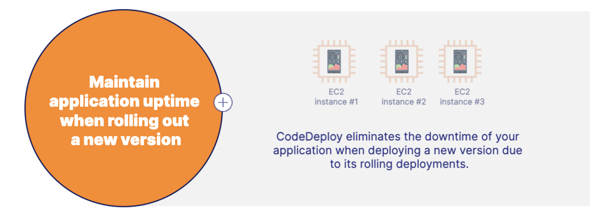
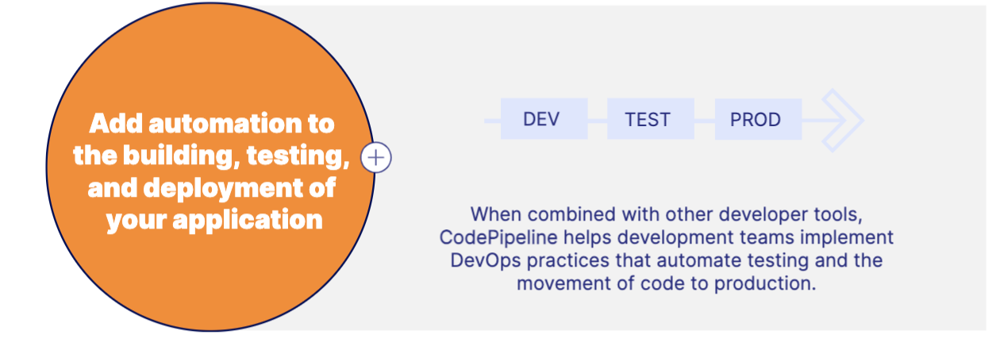
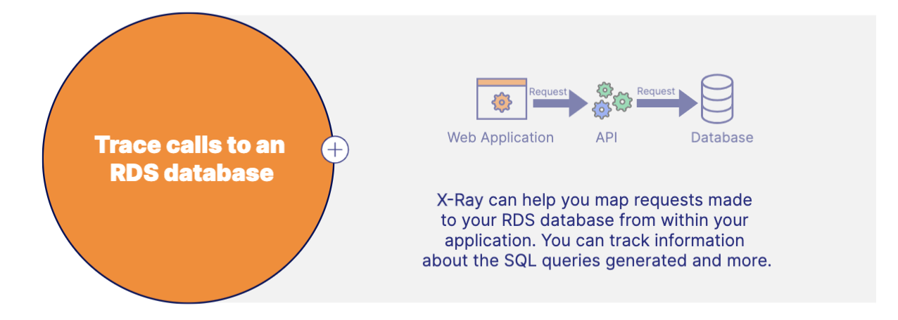
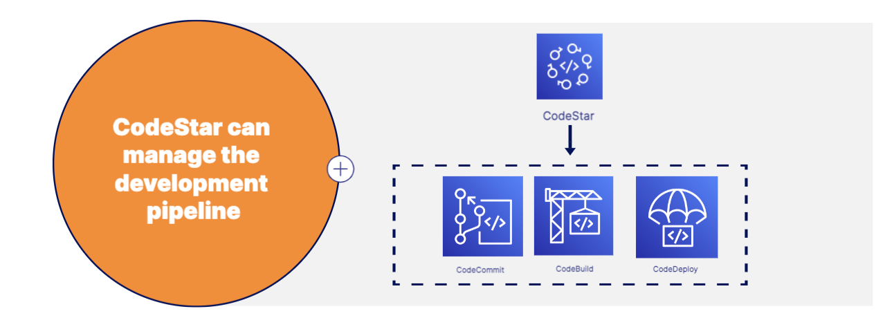

# Developer Tools 
Software developers use tools to accelerate the software development and release cycle.

## Amazon Cloud 9
- Cloud9 allows you to write code within an integrated development environment (IDE) from within your web browser.
- Integrated development environment (IDE), write and debug codes, and Supports popular programming languages. 

## Amazon CodeCommit
- CodeCommit is a source control system for private Git repositories. 
- Create repositories to store codes, Commit, branch, and merge code, and Collaborate with other software developers

## Amazon CodeBuild
- CodeBuild allows you to build and test your application source code. 
- Compile source codes and run test, Enables continuous integration and delivery, Produces build artifacts ready to be deployed

## Amazon CodeDeploy 
- CodeDeploy manages the deployment of code to compute services in the cloud or on-premises.
- Deploys code to EC2, Fargate, Lambda, and on-premises, and maintain application uptime

## Amazon CodePipeline 
- CodePipeline automates the software release process.
- Quickly deliver new features and updates, Integrates with CodeBuild to run builds and unit tests, integrates with CodeCommit to retrieve source code, and integrates with CodeDeploy to deploy your changes. 

## Amazon X-ray 
- X-Ray helps you debug production applications.
- Analyze and debug production applications, map application components, and View requests end to end. 

## Amazon CodeStar
- CodeStar helps developers collaboratively work on development projects.
- Developer connect their development environment, Integrates with CodeCommit, CodeBuild, and CodeDeploy, and Contains issue tracking dashboard

