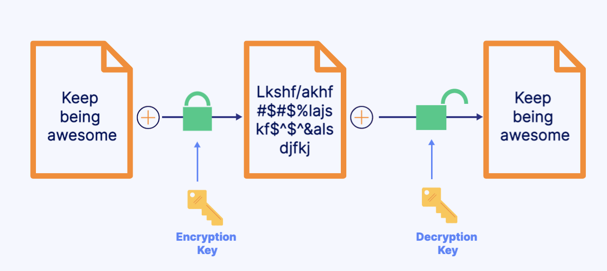

# Data Encryption and Secrets Management Services 

## Data Encryption Definition
Data encryption encodes data so it cannot be read by unauthorized users.
- Data in flight: Data that is moving from one location to another
- Data at rest: Data that is inactive or stored for later use
- 

## Key Management Service(KMS)
- KMS allows you to generate and store encryption keys.
    - Key generator
    - Store and control keys
    - AWS manages encryption keys
    - Automatically enabled for certain services
- Use Case
    - Create encrypted Amazon EBS volumes. When you create an encrypted Amazon EBS volume, you're able to specify a KMS customer master key. 

## CouldHSM
- CloudHSM is a hardware security module (HSM) used to generate encryption keys.
    - Dedicated hardware for security
    - Generate and manage your own encrption keys 
    - AWS does not have access to your keys
- Use Case: 
    - Meet compliance requirements for data security by using dedicated hardware.
    - CloudHSM allows you to meet corporate, contractual, and regulatory compliance requirements for data security by using dedicated hardware in the cloud.

## Secrets Manager
- Secrets Manager allows you to manage and retrieve secrets (passwords or keys). 
    - Rotate, manage, and retrieve secrets
    - Encryption secrets at rest
    - Integrates with services like RDS, Redshift, and DocumentDB
- Use Case:
    - Retrieve database credentials needed for your application code. Secrets Manager allows you to retrieve database credentials with a call to Secrets Manager APIs, removing the need to hardcode sensitive information in plain text within your application code.
