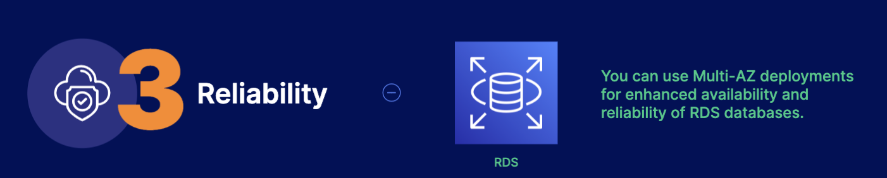

# Well-Architected Framework
The 5 pillars of the Well-Architected Framework describe design principles and best practices for running workloads in the cloud.

## Operational Excellence 
- This pillar focuses on creating applications that effectively support production workloads. 
- Plan for and anticipate failure 
- Deploy smaller reversible changes
- script operations as code 
- learn from failture and refine 
- 

## Security 
- This pillar focuses on putting mechanisms in place that help protect your system and data. 
- Automate security tasks 
- Encrypt data in transit and at rest 
- Assign only the least privilages required 
- Tract who did what and when 
- Ensure security at all application layers 

## Reliability 
- This pillar focuses on designing systems that work consistently and recover quickly 
- Recover form failture automatically 
- Scale horizontally for resilience 
- Reduce idle resources 
- Manage change through automation 
- Test recovery procedures 

## Performance Efficiency 
- This pillar focuses on the effective use of computing resources to meet system and business requirements while removing bottlenecks 
- Use serverledd architectures first 
- Use multi-region deployments 
- Delegate tasks to a cloud vendor 
- Experiment with virtual resources 

## Cost Optimization 
- This pillar focuses on delivering optimum and resilient solutions at the least cost to the user. 
- Utilize consumption-based pricing
- Implement Cloud Fiancial Management 
- Measure overall efficienct 
- Pay only for resources your application requires 
