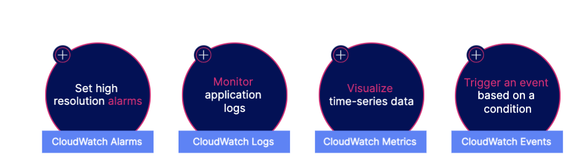
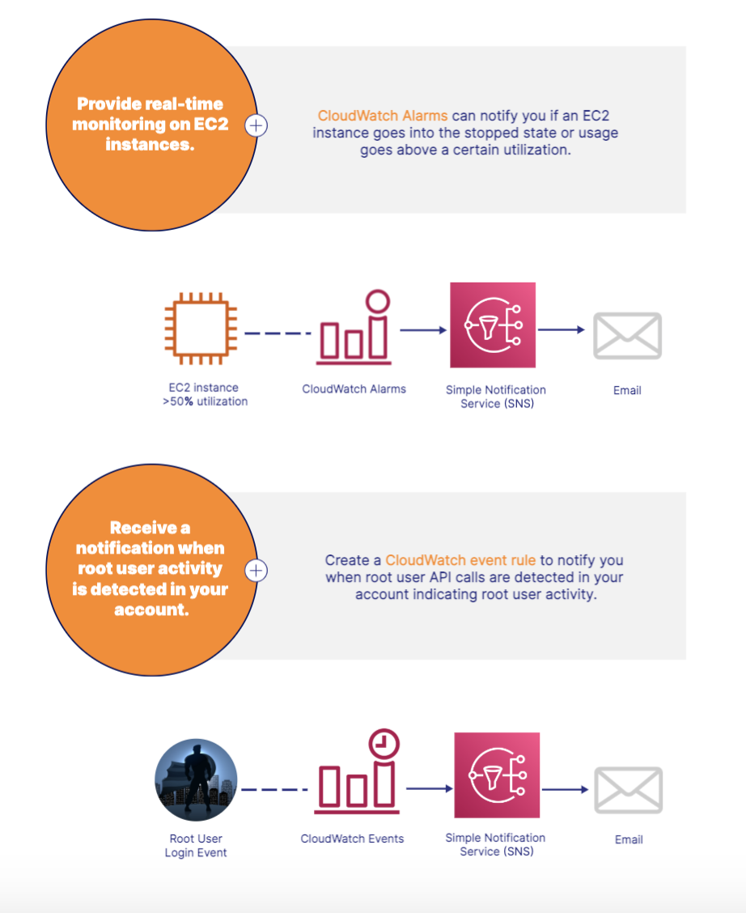
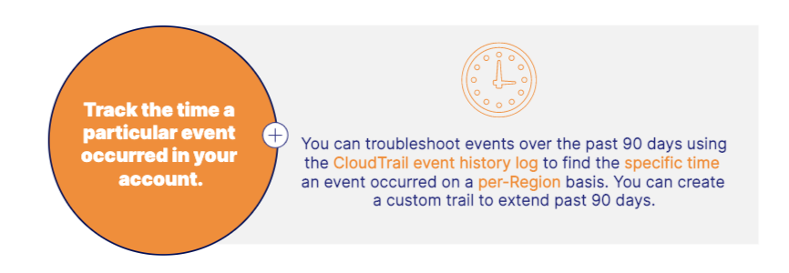

# Auditing, Monitoring, and Logging Services 
These services give you insight into how well your systems are performing and help you proactively find and resolve errors. 
We can answer a lot of questions using these services like: 
    - Who signed in and made changes via the AWS Management Console?
    - What is the current load on this EC2 instance? 
    - Which execution path resulted in this error? 
    - What is the root cause of this application error?

## Amazon CloudWatch 
- CloudWatch is a collection of services that help you monitor and observe your cloud resources.
- Collects metrics, logs, and events, Visualize logs, Set alarms, and Detect anomalies in your environment
- 

- 

## Amazon CloudTrail
- CloudTrail tracks user activity and API calls within your account.
- Log and retain account activity, Track activity through the console, SDKs, and CLI, Identify which user made changes, Detect unusual activity in your account

- Things you can track with CloudTrail: 
    - username, Event time and name, IP address, Access key, Region, Error code 