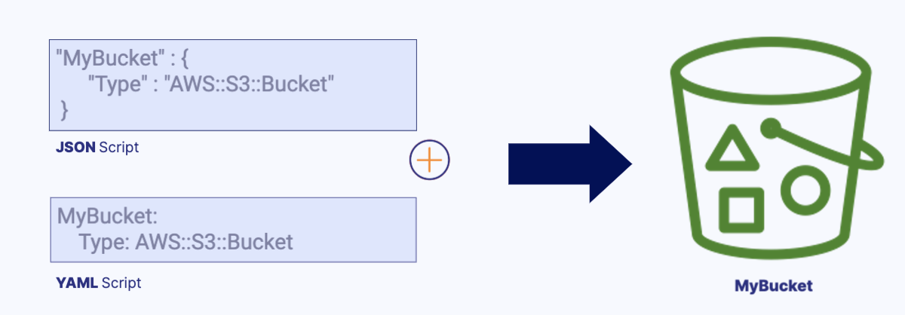
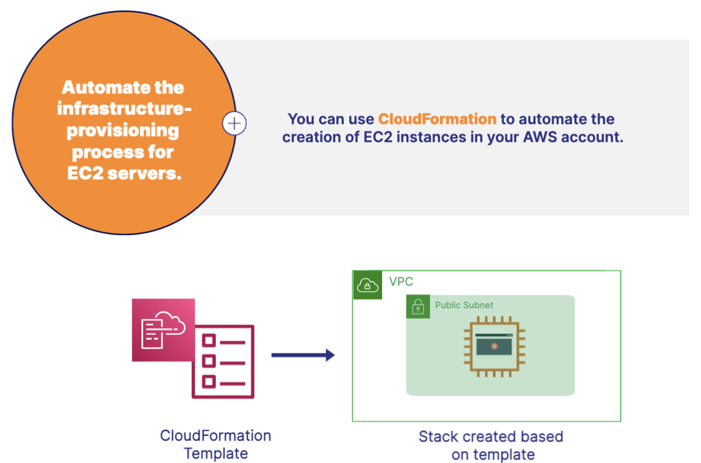
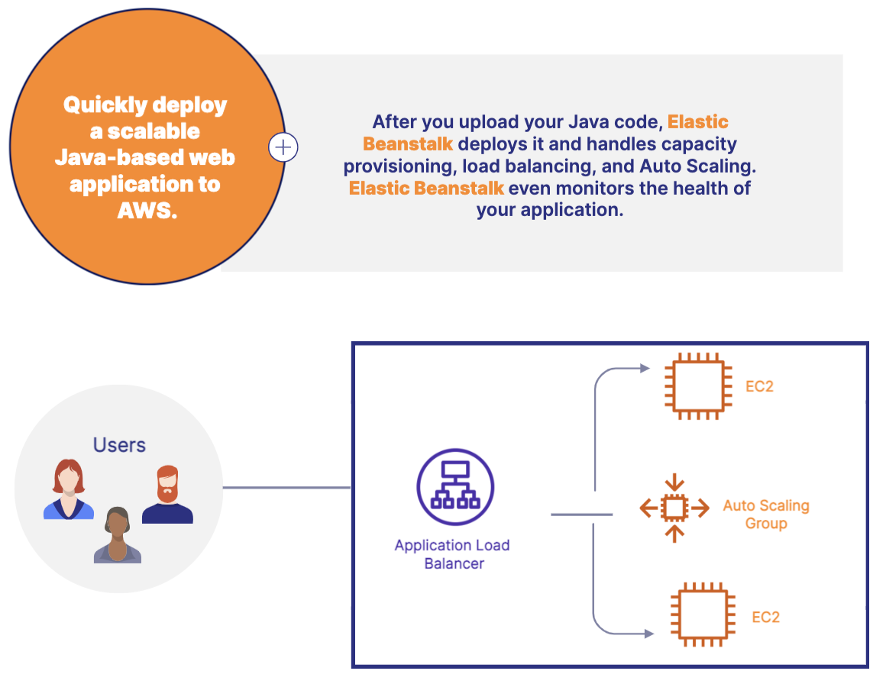
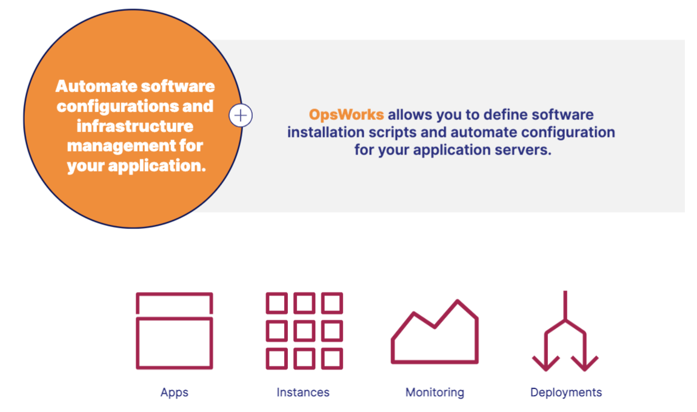

# Deployment and Infrastucture Management Service 
These services help you quickly stand up new applications, automate the management of infrastructure, and provide real-time visibility into system health.

## Infrastructure as Code 
IaC allows you to write a script to provision AWS resources. The benefit is that you provision resources in a reproducible manner that saves time.

## Amazon CloudFormation
- CloudFormation allows you to provision AWS resources using Infrastructure as Code (IaC).
- Provides a repeatable process for provisioning resources
- Works with most AWS services
- Create templates for the resources you want to provision

## Amazon Elastic Beanstalk
- Technically a compute service that you use when you are ready to deploy your application only to AWS cloud not to the on-premises. 
- Elastic Beanstalk allows you to deploy your web applications and web services to AWS.
- Orchestration service that provisions resources
- Automatically handles deployment 
- Monitors application health via a health dashboard

## Amazon OpsWorks
- Deploy codes and manage applications
- Manage on-premises servers or EC2 instances in AWS Cloud
- Works with Chef and Puppet automation platforms

