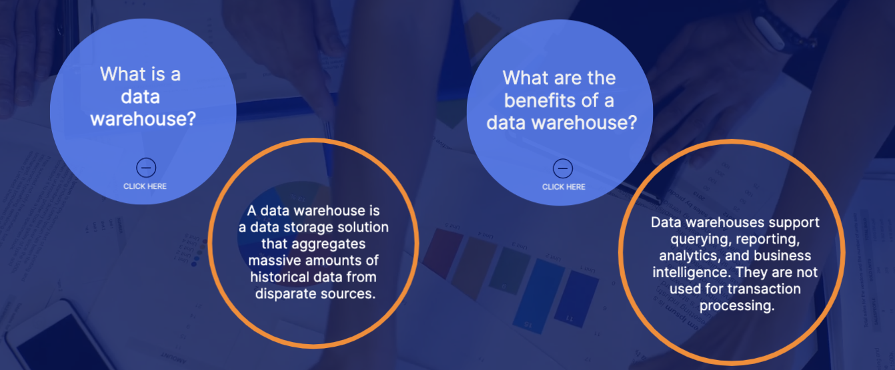

# Leveraging Analytics Services 
Analytics is the act of querying or processing your data.

## Amazon Redshift 
- Redshift is a scalable data warehouse solution.
- Data warehousing solution, improves speed and efficiency, and Handles exabyte-scale data
- use cases: 
    - Data Consolidation: When you need to consolidate multiple data sources for reporting
    - Relational Databases: When you want to run a database that doesn't require real-time transaction processing (insert, update, and delete)

##  Amazon Athena
- Athena is a query service for Amazon S3.
- query service, Analyze S3 data using SQL, pay per query, and considered serverless 

## Amazon Glue 
- Glue prepares your data for analytics.
- Extract, transform, load (ETL) service, prepare and load data, and Helps to better understand your data. 

## Amazon Kinesis
- Kinesis allows you to analyze data and video streams in real time.
- Analyze real-time and streaming data, and Supports video, audio, application logs, website clickstreams, and IoT. 

## Amazon Elastic MapReduce(EMR)
- EMR helps you process large amounts of data
- Process big data, Analyze data using Hadoop, and Works with big data frameworks

## Amazon Data Pipeline 
- Data Pipeline helps you move data between compute and storage services running either on AWS or on-premises.
- Moves data at specific intervals, Moves data based on conditions, and Sends notifications on success or failure. 

## Amazon QuickSight 
- QuickSight helps you visualize your data.
- Build interactive dashboards, and Embed dashboards in your applications

