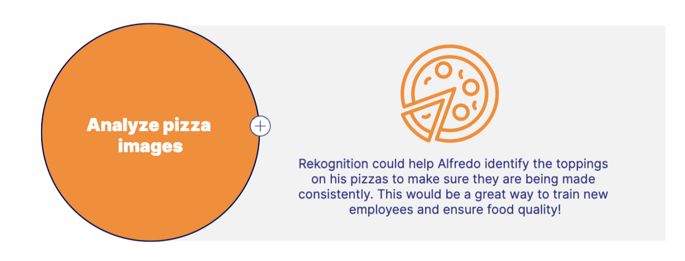
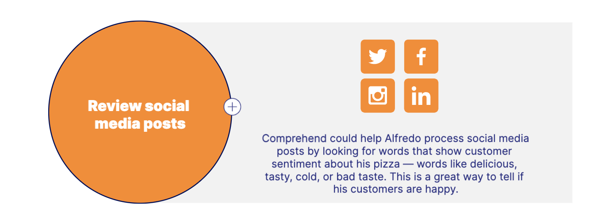
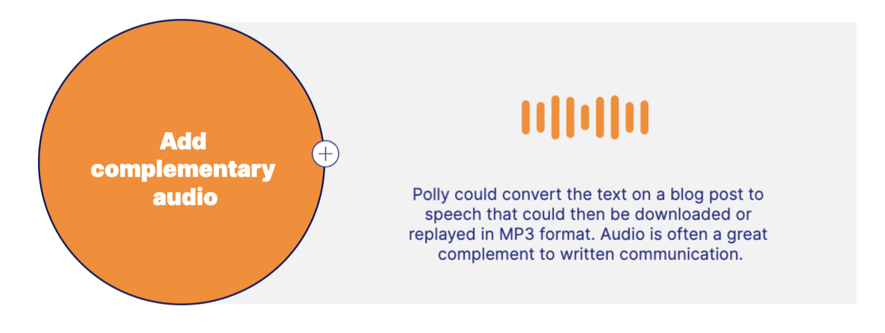
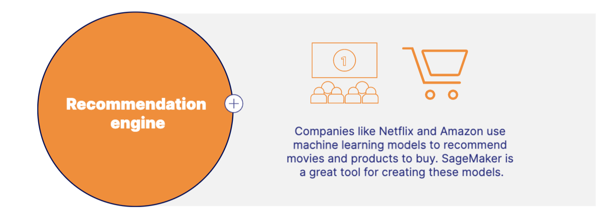
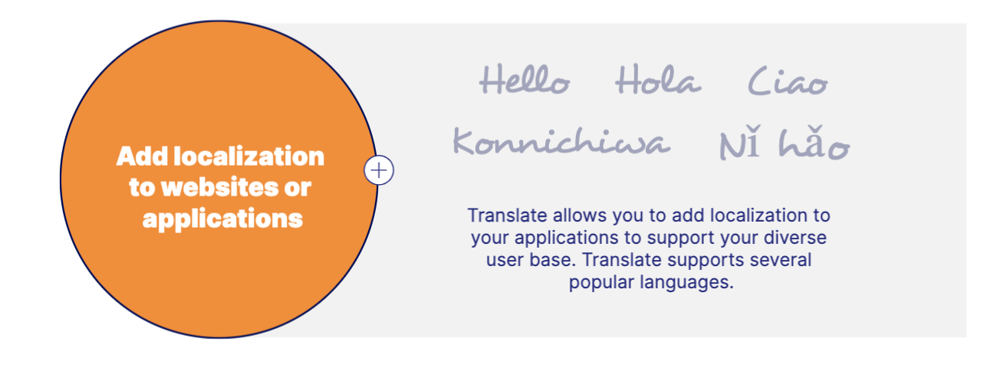
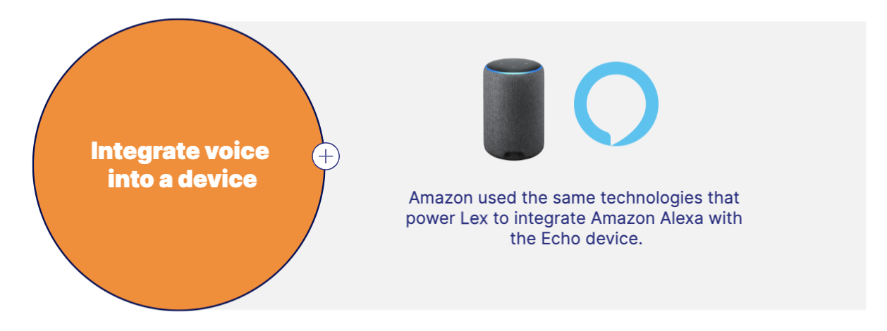

# Machine Learning Services 
Businesses leverage AI and machine learning to add intelligence to their applications and leverage trends and patterns in data. 

## Amazon Rekognition 
- Rekognition allows you to automate your image and video analysis.
- Image and video analysis, Identify custom labels in images and videos, and Face and text detection in images and videos. 

## Amazon Comprehend
- Comprehend is a natural-language processing (NLP) service that finds relationships in text.
- Natural-language processing (NLP) service 
- Uncovers insights and relationships 
- Analyzes text

## Amazon Polly 
- Polly turns text into speech
- Mimics natural-sounding human speeches 
- Several voices across many languages 
- Can create a custom voice

## Amazon Sagemaker
- SageMaker helps you build, train, and deploy machine learning models quickly.
- Prepare data for models, Train and deploy models, and Provides Deep Learning AMIs

## Amazon Translate
- Translate provides language translation.
- Provides real-time and batch language translation, supports many languages, and Translates many content formats

## Amazon Lex 
- Lex helps you build conversational interfaces like chatbots.
- Recognizes speech and understands language, build high-engaging chatbots, and Powers Amazon Alexa

