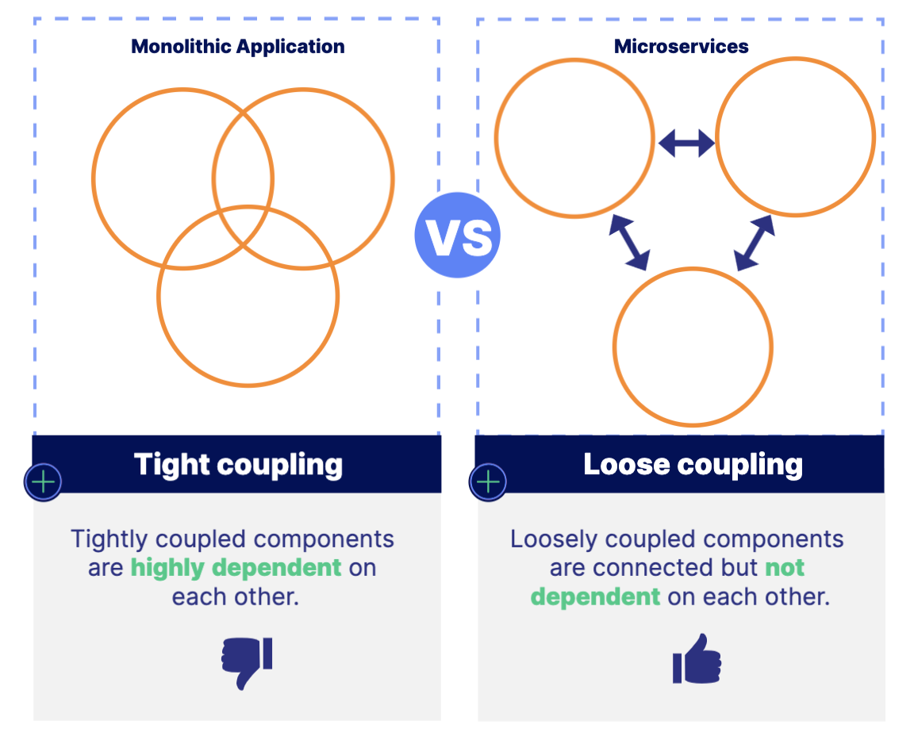
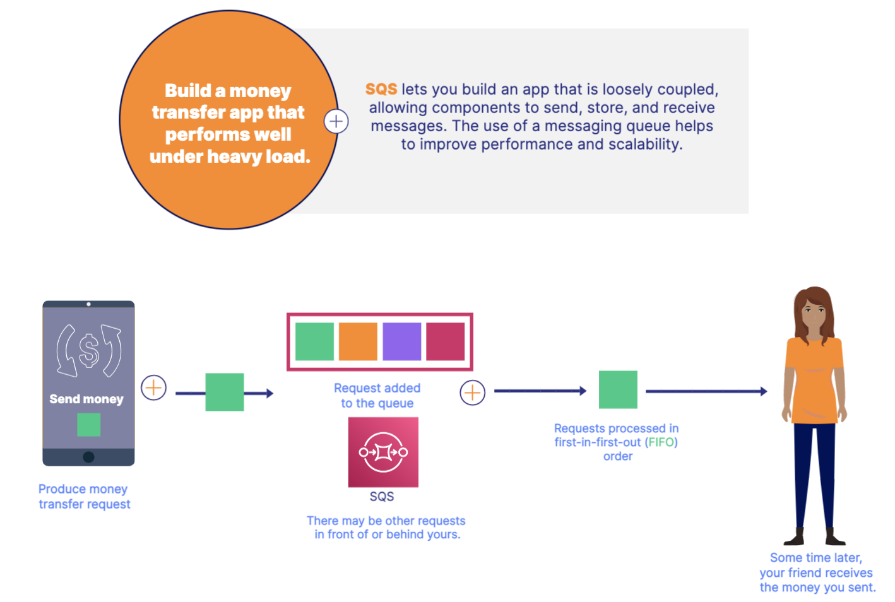
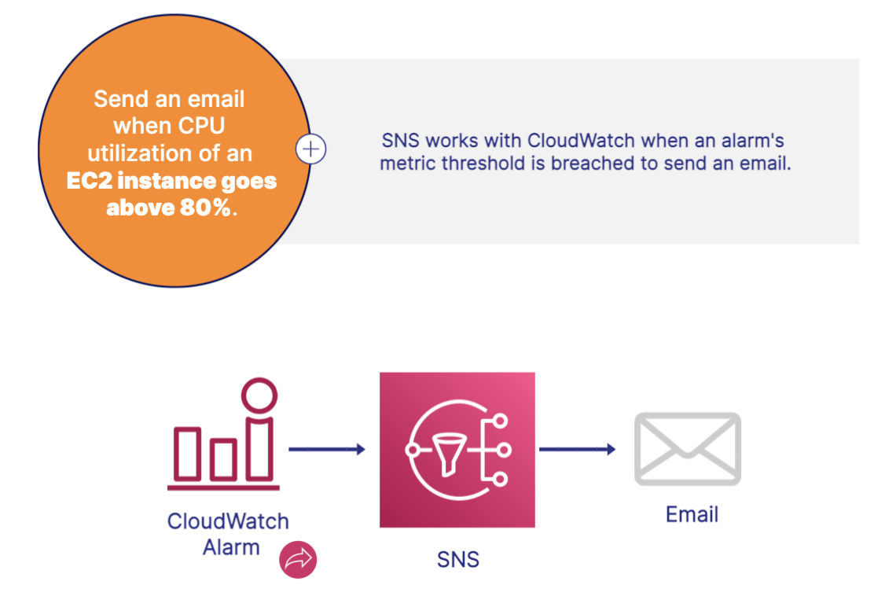

# Messaging and Integration Services 

## Loose Coupling 
Coupling defines the interdependencies or connections between components of a system. Loose coupling helps reduce the risk of cascading failures between components.

Queues are used to implement loose coupling systems.

## Simple Queue Service(SQS)
- SQS is a message queuing service that allows you to build loosely coupled systems.
- Allows component-to-component communication using messaging. 
- Multiple components (or producers) can add messages to the queue
- Messages are processed in an asynchronous manner
- Messages in queues are processed in FIFO order 

## Simple Notification Service(SNS)
- Send text messages and plain text emails.  
- SNS allows you to send emails and text messages from your applications.
- Send email and text messages, Publish messages to a topic, and subscribers receive messages

## Simple Email Service(SES)
- HTML-formatted emails for marketing campaigns
- SES is an email service that allows you to send richly formatted HTML emails from your applications.
- Ideal choice for marketing campaigns or professional emails
- Unlike SNS, SES sends HTML emails

## Additional Services
- Amazon Workspaces 
    - Amazon Workspaces allow you to host virtual desktops in the cloud. 
    - Virtual Windows or Linux desktops 
    - Enables employees to work from home 
- Amazon Connect 
    - Amazon Connect is cloud contact center service 
    - Provides cumstomer service functionality 
    - Improves productivity of help desk agents through real time alarting and monitoring. 