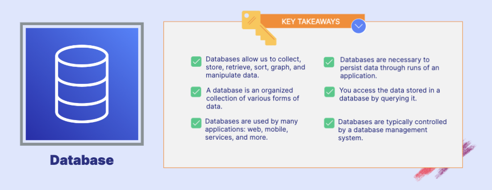

# Utilizing Databases 

## Amazon Relational Database Service(RDS)
- RDS is a service that makes it easy to launch and manage relational databases. 
- Supports popular database engines
- Offers high availability and fault tolerance using Multi-AZ deployment option
- AWS manages the database with automatic software patching,  automated backups, operating system maintenance, and more.

## Amazon Aurora 
- Aurora is a relational database compatible with MySQL and PostgreSQL that was created by AWS.
- Supports MySQL and PostgreSQL database engines 
- 5x faster than normal MySQL and 3x faster than normal PostgreSQL
- Scales automatically while  providing durability and high availability
- Managed by RDS

## Amazon DynamoDB 
- DynamoDB is a fully managed NoSQL key-value and document database.
- NoSQL key-value database
- Fully managed and serverless 
- Not relational 
- Scales automatically to massive workloads with fast performance

## Amazon DocumentDB 
- DocumentDB is a fully managed document database that supports MongoDB.
- Document Database, MongoDB compatible, Fully managed and serverless, and not relational

## Amazon ElastiCache 
- ElastiCache is a fully managed in-memory datastore compatible with Redis or Memcached
- In-memory datastore
- Compatible with Redis or Memcached engines
- Data can be lost 
- Offers high performance and low latency

## Amazon Neptune 
- Neptune is a fully managed graph database that supports highly connected datasets.
- Graph Database Service 
- Supports highly connected datasets like social media networks
- Fully managed and serverless
- Fast and reliable

