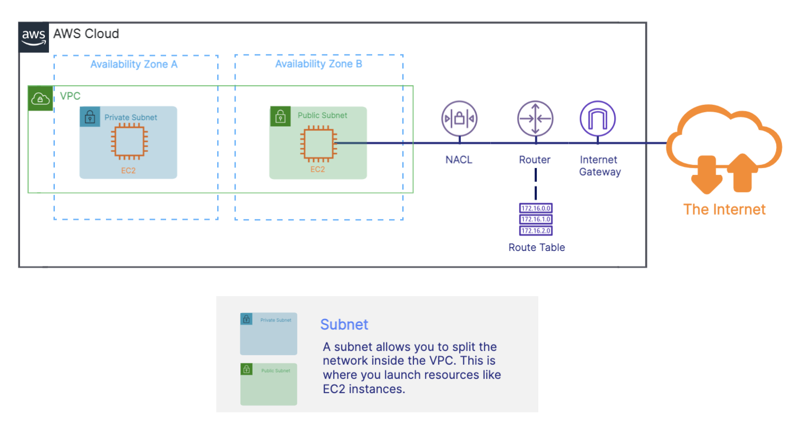
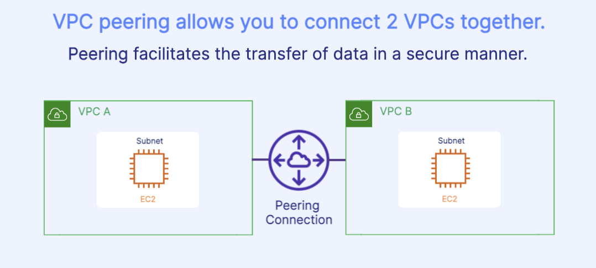

# Understanding VPC and Subcomponents 
Networking connects computers together and allows for the sharing of data and applications, around the globe, in a secure manner using virtual routers, firewalls, and network management services.

## Amazon Virtual Private Cloud(VPC)
- VPC is a foundational service that allows you to create a secure private network in the AWS cloud where you launch your resources.
    - private virtual network
    - Launch resources like EC2 instances inside the VPC
    - solate and protect resources
    - A VPC spans Availability Zones in a Region 

## Subcomponents 

- Network ACL: Access control lists(ACL) ensure the proper traffic is allowed into the subnet. 
- Router and Route Table: Defines where network traffic is routed 
- Internet Gateway: An internet gateway allows public traffic to the internet from a VPC 

