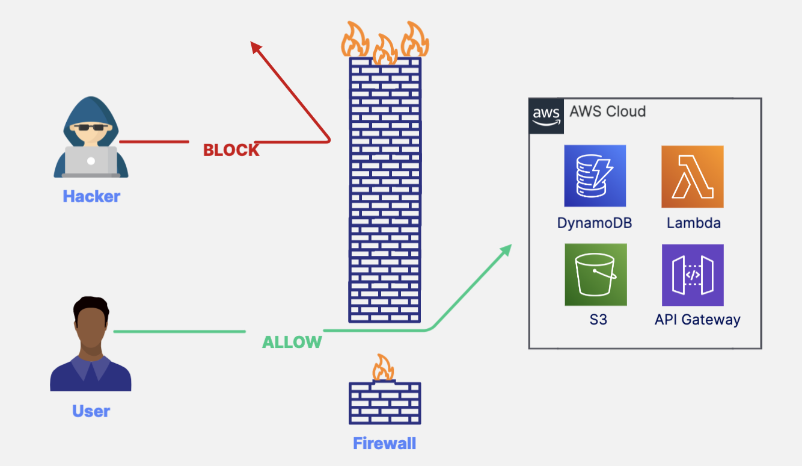
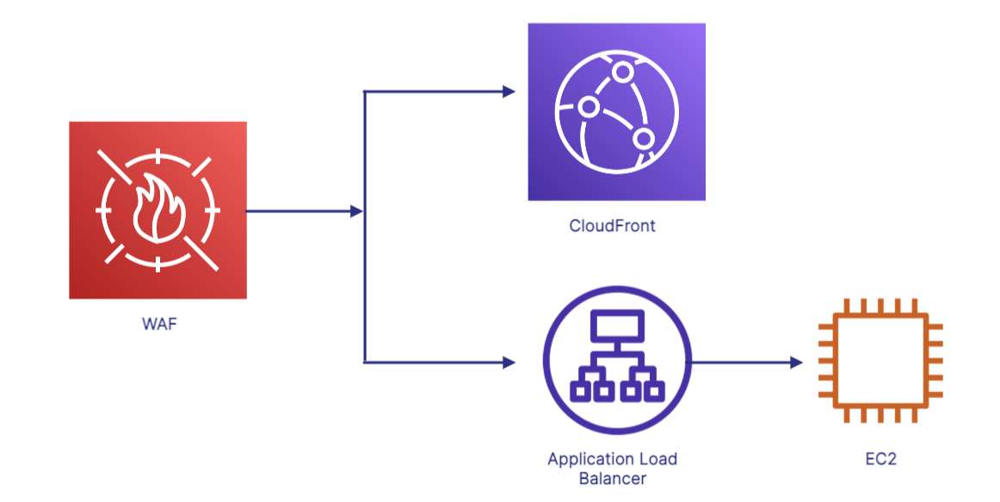
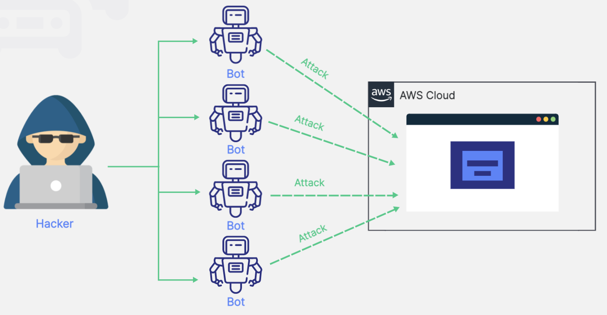
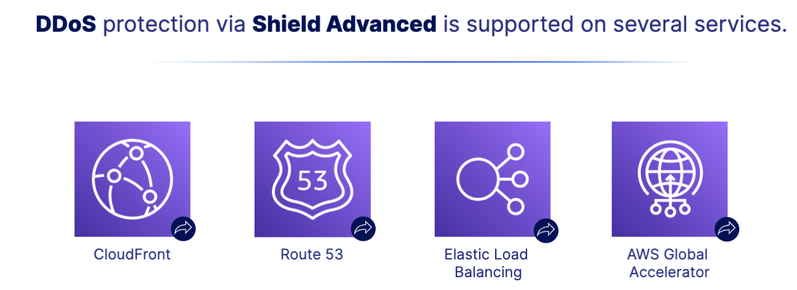

# Application Security Services 
AWS has several software-based security tools available to help you monitor and protect your resources.
## What is Firewall:
Firewalls prevent unauthorized access to your networks by inspecting incoming and outgoing traffic against security rules you've defined. 

## Web Application Firewall(WAF)
- WAF helps protect your web applications against common web attacks.
    - Protects apps against common attack pattern
    - Protects against SQL injection 
    - Protects against cross-site scripting
- Use cases: 
    - You can deploy a web application directly to an EC2 instance and protect it from cross-site scripting attacks using WAF. You can even deploy WAF on CloudFront as part of your CDN solution to block malicious traffic.
    

## Distruted Denial of Service 
A DDoS attack causes a traffic jam on a website or web application in an attempt to cause it to crash.

## Shield 
- Shield is a managed Distributed Denial of Service (DDoS) protection service.
    - Always-on detection 
    - Shield Standard is free
    - Shield Advanced is a paid service 
- Shield Standard VS. Shield Advanced 
    - Shield Standard: Provides free protection against common and frequently occurring attacks. 
    - Shield Advanced: Provides enhanced protections and 24/7 access to AWS experts for a fee. 
- DDoS via Shield Advanced is supported by serveral services. 
    -
- Use case: 
    - Receive real-time notifications of suspected DDoS incidents and assistance from AWS during the attack. Shield Advanced will give you notifications of DDoS attacks via CloudWatch metrics. Additionally, with Shield Advanced, you have 24/7 access to AWS experts to assist during an attack.

## Macie 
- Macie helps you discover and protect sensitive data.
    - Use machine learning 
    - Evaluates S3 environment
    - Uncovers personally identifiable information (PII) 
- Use Cases: 
    - Discover passport numbers stored on S3. Macie can be used to find sensitive data like passport numbers, social security numbers, and credit card numbers on S3.

## Config 
- Config allows you to assess, audit, and evaluate the configurations of your resources.
    - Track configuration changes over time 
    - Delivers configuration history file to S3
    - Notifications via Simple Notification Service (SNS) of every configuration change
- Use Case: 
    - Identify system-level configuration changes made to your EC2 instances. Config allows you to record configuration changes within your EC2 instances. You can view network, software, and operating system (OS) configuration changes, system-level updates, and more.

## GuardDuty
- GuardDuty is an intelligent threat detection system that uncovers unauthorized behavior.
    - Use machine learning 
    - Built-in detection for EC2, S3, and IAM
    - Reviews CloudTrail, VPC Flow Logs, and DNS logs
- Use Case: 
    - Detect unusual API calls in your account. GuardDuty's anomaly detection feature evaluates all API requests in your account and identifies events that are associated with common techniques used by attackers.

## Inspector 
- Inspector works with EC2 instances to uncover and report vulnerabilities.
    - Agent installed on EC2 instance 
    - Reports vulnerabilities found
    - Checks access from the internet, remote root login, vulnerable software versions, etc.
- Use Case: 
    - Identify unintended network access to an EC2 instance via a detailed report of security findings. Inspector has several built-in rules to access your EC2 instances to find vulnerabilities and report them prioritized by level of severity.

## Artifact
- Artifact offers on-demand access to AWS security and compliance reports.
    - Central repository for compliance reports from third-party auditors. 
    - Service Orgranization Controls(SoC) reports. 
    - Payment Card Industry (PCI) reports
- Use Case: 
    - You need to access AWS' certification for ISO compliance. Artifact provides a central repository for AWS' security and compliance reports via a self-service portal.

## Cognito 
- Cognito helps you control access to mobile and web applications.
    - Provides authentication and authorization
    - Helps you manage users 
    - Assists with user sign-up and sign-in 
- Use Case: 
    - You need to add social media signin to your web application. Cognito provides functionality that allows your users to sign in to your application through social media accounts like Facebook and Google.
