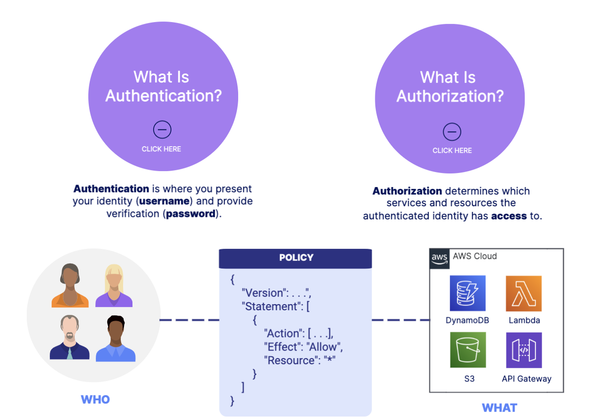
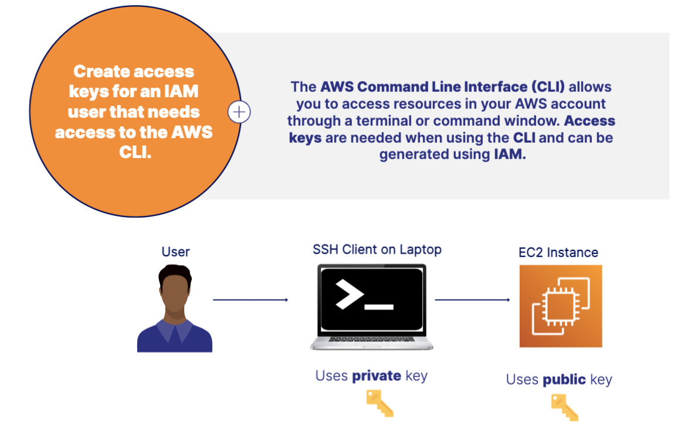
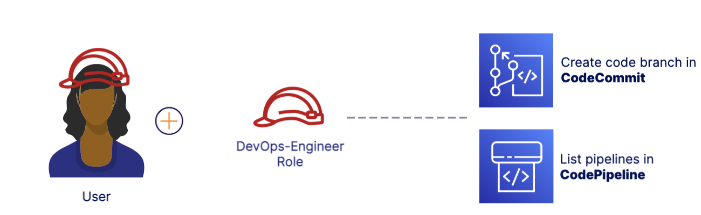
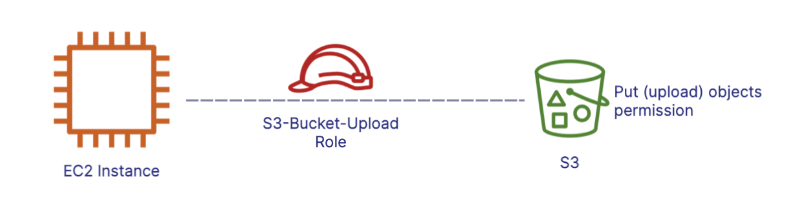
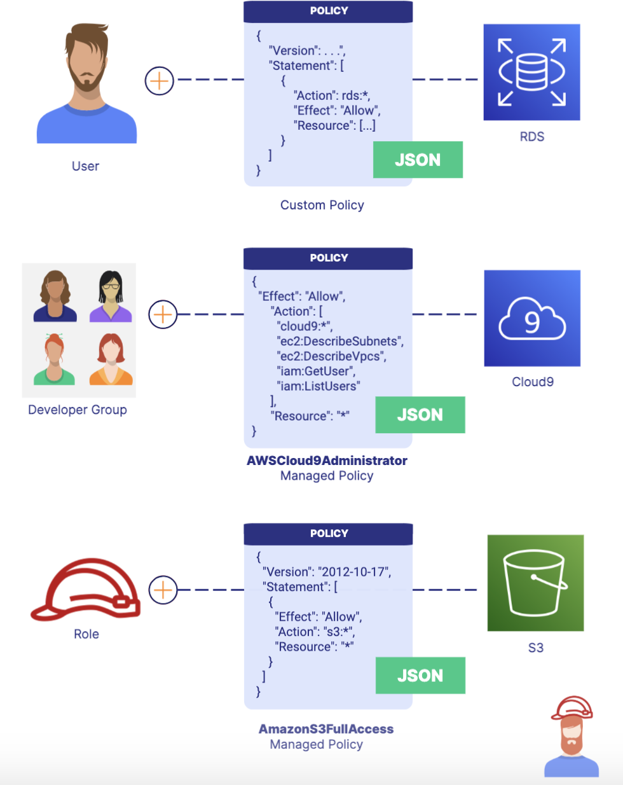

## Understanding IAM Users 
Stories about companies being hacked and customer data being stolen are rampant. Now that you have workloads running in the cloud, it is important that you take the necessary steps to keep your applications and data safe and secure.

## Identity and Access Management (IAM)
- IAM allows you to control access to your AWS services and resources.
    - Helps you secure your cloud resources
    - You define who has access
    - You define what they can do 
    - A free global service 
- Identities VS. Access
    - Identities (Who can access your resources): Root user, Individual users, Groups, and Roles
    - Access(What resouce they can access): Policies, AWS managed policies, Customer managed policies, and Permissions boundaries 
- Authentication("who") VS. Authorization("What"): 
    

## Users 
- Users are entities you create in IAM to represent the person or application needing to access your AWS resources.

- Principle of Least priviledge: 
    - The principle of least privilege involves giving a user the minimum access required to get the job done. 
    - 
- Use Case:
    

## Groups 
- A group is a collection of IAM users that helps you apply common access controls to all group members.
- Administrators, Developers, and Analysts: 
    - Administrators: Administrators perform administrative tasks such as creating new users.
    - Developers: Developers use compute and database services to build applications.
    - Analysts: Developers use compute and database services to build applications.
- Use case: 
    - Groups save you time by allowing you to apply the same access permissions to more than one user at once. When a user no longer needs access, they can be removed from the group.
- Key Takesways: 
    - Do not confuse security groups for EC2 with IAM groups. EC2 security groups act as firewalls, while IAM groups are collections of users.
    - Used to group user that perform similar tasks.
    - Access permissions apply to all members of the group.
    - Access is assigned using policies and roles

## IAM Permissions 
- Roles: 
    - Roles define access permissions and are temporarily assumed by an IAM user or service.(IAM can not only be the users who log in but also can give access to a service. For example, Lambda function may need access to DynamoDB during its execuiton. )
    - DevOps-Engineeer Role: 
        
    - Lambda-Execution Role
        
    - Key Takeaways: 
        - You assume a role to perform a task in a single session. 
        - Assumed by any user or service that needs it.
        - Access is assigned using policies.
        - You grant users in one AWS account access to resources in another AWS account.
    - Use cases: 
        - You can attach a role to an instance that provides privileges (e.g., uploading files to S3) to applications running on the instance. Roles help you avoid sharing long-term credentials like access keys and protect your instances from unauthorized access.
        - Attach a role to an EC2 instance to access S3: 
        

- Policies: 
    - You manage permissions for IAM users, groups, and roles by creating a policy document in JSON format and attaching it.
    - 
    - Use Case: 
        - You can add a bucket access policy directly to an Amazon S3 bucket to grant IAM users access permissions for the bucket and the objects in it.

- IAM Best Practices: 
    - Enable MFA for privileged users: 
        - You should enable multi-factor authentication (MFA) for the root user and other administrative users.
    - Implement strong password policies: 
        - You should require IAM users to change their passwords after a specified period of time, prevent users from reusing previous passwords, and rotate security credentials regularly.
    - Create individule users instead of using root: 
        - You shouldn't use the root user for daily tasks. 
    - Use roles for Amazon EC2 instances: 
        - You should use roles for applications that run on EC2 instances instead of long-term credentials like access keys.

- IAM Credential Report: 
    - The IAM credential report lists all users in your account and the status of their various credentials.
    - Lists all users and status of passwords, access keys, and MFA devices
    - Using for auditting and compliance