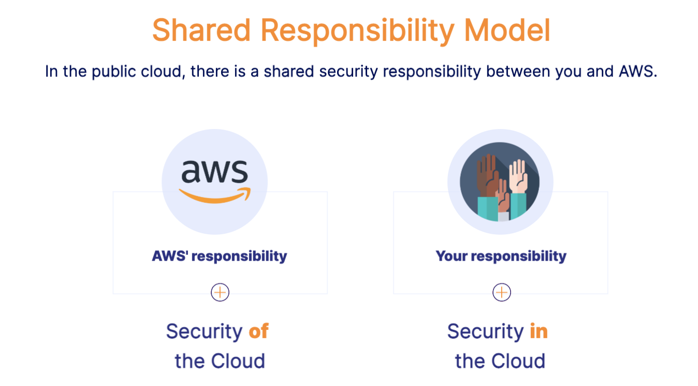
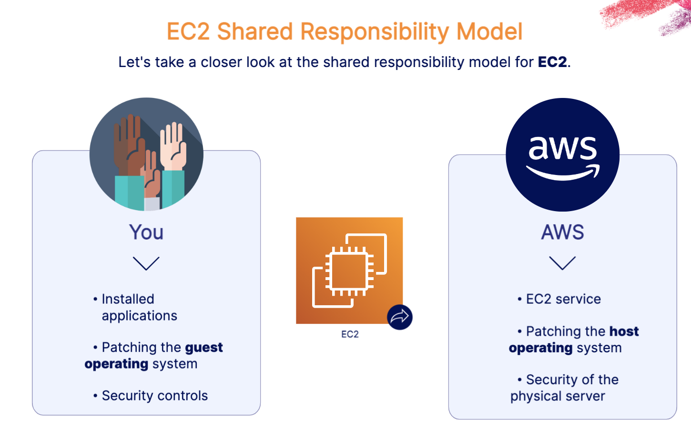
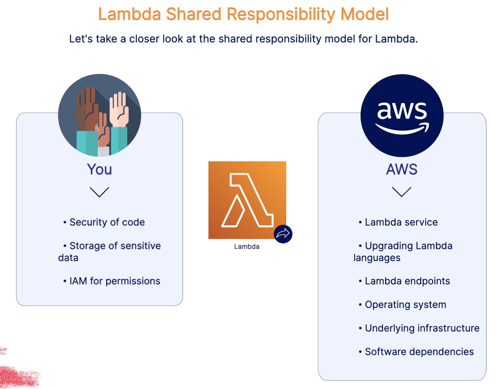
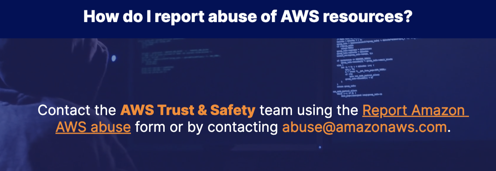

# Shared Responsibility Model 

## Security of Cloud VS. Security in Cloud
- Sercuity of Cloud(AWS): AWS is responsible for protecting and securing their infrastructure.
    - AWS Global Infrastructure: AWS is responsible for its global infrastructure elements: Regions, edge locations, and Availability Zones.
    - Building Security: AWS controls access to its data centers where your data resides.
    - Networking Components: AWS maintains networking components: generators, uninterruptible power supply (UPS) systems, computer room air conditioning (CRAC) units, fire suppression systems, and more.
    - Software: AWS is responsible for any managed service like RDS, S3, ECS, or Lambda, patching of host operating systems, and data access endpoints
- Security in Cloud(you):You are responsible for how the services are implemented and managing your application data. 
    - Application Data: You are responsible for managing your application data, which includes encryption options.
    - Security Configuration: You are responsible for securing your account and API calls, rotating credentials, restricting internet access from your VPCs, and more.
    - Patching: You are responsible for the guest operating system (OS), which includes updates and security patches.
    - Identity and Access Management: You are responsible for application security and identity and access management.
    - Network Traffic: You are responsible for network traffic protection, which includes security group firewall configuration.
    - Installed SoftwareLYou are responsible for your application code, installed software, and more. You should frequently scan for and patch vulnerabilities in your code.

## EC2 Shared Responsibility Model 

## Lambda Shared Responsibility Model

## Which repsonsibilities are shared?
- Patch Management 
- Configuration Management 
- Awareness and Train 

